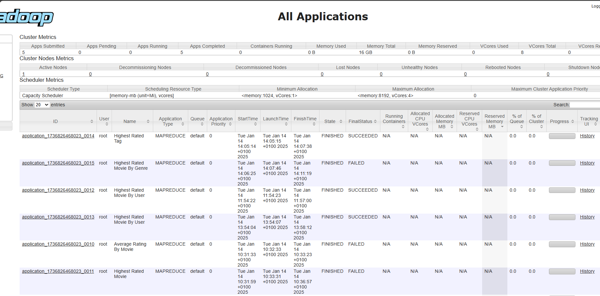

# **Rapport détaillé l’évolution du projet Hadoop**

---

## **Introduction**

Le projet avait pour but d'utiliser Hadoop et MapReduce pour traiter les données de films, en analysant des fichiers tels que `movies.csv` et `ratings.csv`. L'objectif était de répondre à plusieurs questions avancées, impliquant des jointures et des comptages complexes, et d'en apprendre davantage sur le traitement distribué des données à grande échelle.

Les étapes ont été réalisées en travaillant dans le répertoire suivant :
```
hadoop-first-code\src\main\java\org\hadoop\examples\hadoop\project
```

---

## **Structure et environnement**

### **Arborescence du projet**
```
project
├───driver
├───mapper
└───reducer
```

### **Configuration de l'environnement**
1. **Cluster Hadoop avec Docker :**
    - Un fichier `docker-compose.yml` a été utilisé pour lancer un cluster Hadoop comprenant les services suivants : `namenode`, `datanode`, `resourcemanager`, `nodemanager`.
    - Le réseau Docker a été configuré pour éviter les conflits (`hadoop`).

2. **Commandes pour configurer le cluster :**
    - **Nettoyer les services existants :**
      ```bash
      docker-compose down -v
      ```
    - **Lancer le cluster :**
      ```bash
      docker-compose up -d
      ```
    - **Vérifier les services :**
      ```bash
      docker ps
      ```

3. **Accès aux conteneurs :**
   ```bash
   docker exec -it namenode /bin/bash
   ```

---

## **1ère étape : Trouver le film le mieux noté par utilisateur**

### **Objectif**
Identifier le `movieId` ayant obtenu la note maximale pour chaque utilisateur.

### **Mise en œuvre**
#### **Mapper : SKHighestRatedMovieMapper**
- Lit chaque ligne de `ratings.csv`.
- Émet `(userId, movieId:rating)`.

#### **Reducer : SKHighestRatedMovieReducer**
- Trouve le film avec la note maximale pour chaque utilisateur.

#### **Driver : SKHighestRatedMovieDriver**
- Configure le job Hadoop pour mapper et réduire les données.

#### **Commandes**
1. **Charger les fichiers dans HDFS :**
   ```bash
   hdfs dfs -put /path/to/ratings.csv /input_ml25m/ratings.csv
   ```
2. **Exécuter le job :**
   ```bash
   hadoop jar /tmp/hadoop-first-code-1.0-SNAPSHOT.jar org.hadoop.examples.hadoop.project.driver.SKHighestRatedMovieDriver /input_ml25m/ratings.csv /output_highest_rated_movie_user
   ```
3. **Résultats :**
   ```bash
   hdfs dfs -cat /output_highest_rated_movie_user/part-*
   ```

#### **Résultat (extrait)**
```
99985   1 (Rating: 5.0)
99986   2395 (Rating: 5.0)
99987   1 (Rating: 5.0)
```

---

## **2ème étape : Jointure pour obtenir les titres des films**

### **Objectif**
Associer les titres des films à chaque utilisateur ayant donné une note maximale.

### **Mise en œuvre**
#### **Mapper 1 : SKMoviesMapper**
- Lit `movies.csv`.
- Émet `(movieId, MOVIE:movieTitle)`.

#### **Mapper 2 : SKUserRatingsMapper**
- Lit les résultats de la 1ère étape.
- Émet `(movieId, USER:userId)`.

#### **Reducer : SKMoviesJoinReducer**
- Combine les données pour produire `(userId, movieTitle)`.

#### **Driver : SKMoviesJoinDriver**
- Configure le job Hadoop pour mapper et réduire les données.

#### **Commandes**
1. **Charger les fichiers dans HDFS :**
   ```bash
   hdfs dfs -put /tmp/movies.csv /input_ml25m/movies.csv
   hdfs dfs -put /output_highest_rated_movie_user /input/user_ratings.csv
   ```
   
   
2. **Exécuter le job :**
   ```bash
   hadoop jar /tmp/hadoop-first-code-1.0-SNAPSHOT.jar org.hadoop.examples.hadoop.project.driver.SKMoviesJoinDriver /input_ml25m/movies.csv /input/user_ratings.csv /output_movies_user_likes
   ```
   
3. **Résultats :**
   ```bash
   hdfs dfs -cat /output_movies_user_likes/part-*
   ```

#### **Résultat (extrait)**
```
64695   Last Man Standing (1996)
8802    It's Such a Beautiful Day (2012)
```

---

## **3ème étape : Compter le nombre d’utilisateurs par film**

### **Objectif**
Compter combien d’utilisateurs ont aimé chaque film.

### **Mise en œuvre**
#### **Mapper : SKCountUsersPerMovieMapper**
- Transforme `(userId, movieTitle)` en `(movieTitle, 1)`.

#### **Reducer : SKCountUsersPerMovieReducer**
- Compte les occurrences de chaque film.

#### **Driver : SKCountUsersPerMovieDriver**
- Configure le job Hadoop.

#### **Commandes**
1. **Exécuter le job :**
   ```bash
   hadoop jar /tmp/hadoop-first-code-1.0-SNAPSHOT.jar org.hadoop.examples.hadoop.project.driver.SKCountUsersPerMovieDriver /output_movies_user_likes /output_users_per_movie
   ```
2. **Résultats :**
   ```bash
   hdfs dfs -cat /output_users_per_movie/part-*
   ```

#### **Résultat (extrait)**
```
Zero Effect (1998)      4
Zootopia (2016)         29
```

---

## **4ème étape : Grouper les films par nombre d’utilisateurs**

### **Objectif**
Grouper les films par le nombre d’utilisateurs qui les ont aimés.

### **Mise en œuvre**
#### **Mapper : SKInvertKeyValueMapper**
- Transforme `(movieTitle, userCount)` en `(userCount, movieTitle)`.

#### **Reducer : SKGroupMoviesByUserCountReducer**
- Regroupe les films par `userCount`.

#### **Driver : SKGroupMoviesDriver**
- Configure le job Hadoop.

#### **Commandes**
1. **Exécuter le job :**
   ```bash
   hadoop jar /tmp/hadoop-first-code-1.0-SNAPSHOT.jar org.hadoop.examples.hadoop.project.driver.SKGroupMoviesDriver /output_users_per_movie /output_grouped_movies
   ```
2. **Résultats :**
   ```bash
   hdfs dfs -cat /output_grouped_movies/part-*
   ```

#### **Résultat (extrait)**
```
4    Zero Effect (1998), Zulu (1964)
29   Zootopia (2016)
```

---

## **Analyse et perspectives**

### **Problèmes rencontrés et solutions**
1. **Fichiers introuvables dans HDFS :**
    - Problème corrigé en vérifiant les chemins d’entrée et en replaçant les fichiers dans HDFS.

2. **Structure incorrecte des données :**
    - Ajustement des délimiteurs et validation des lignes dans les Mappers.

3. **Résultats vides :**
    - Analyse approfondie des Reducers pour détecter les erreurs logiques.

---

## **Conclusion**
Le projet a permis d’explorer les concepts clés de MapReduce et d’Hadoop à travers des questions avancées, notamment des jointures et des regroupements complexes. Les résultats obtenus répondent avec succès aux objectifs.

